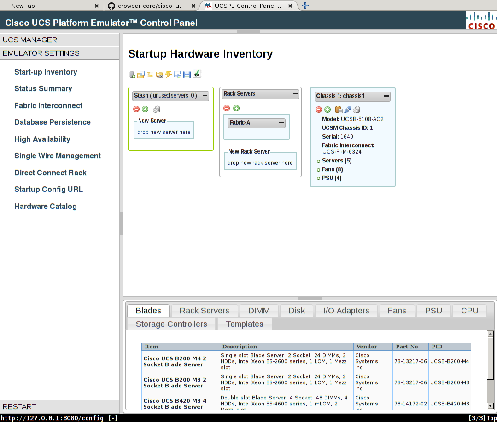
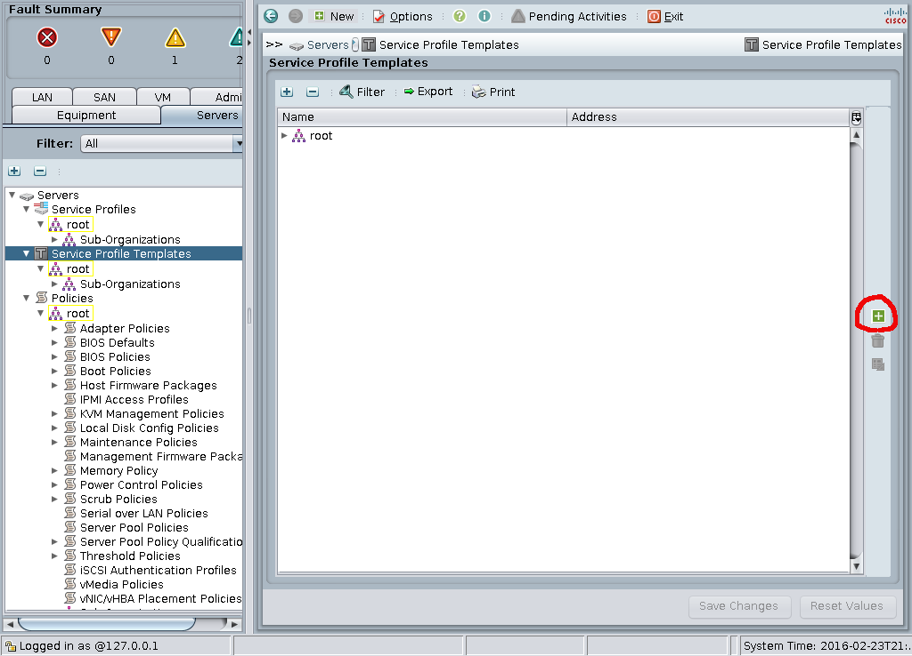
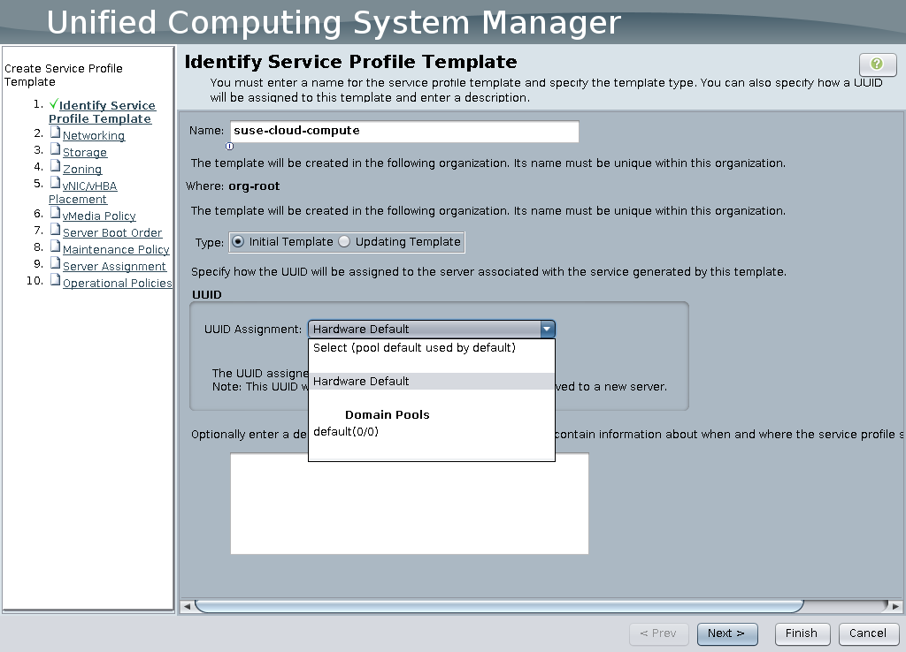
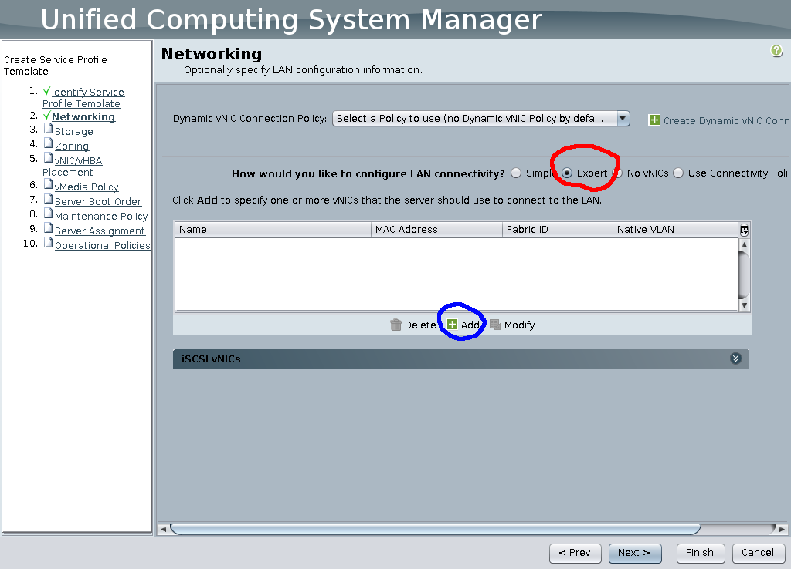
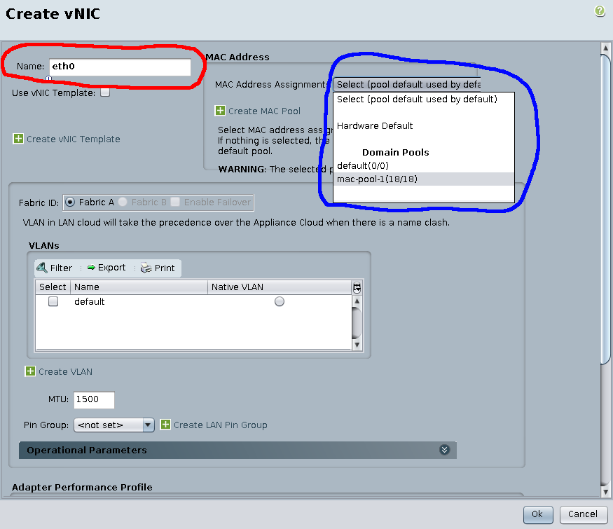
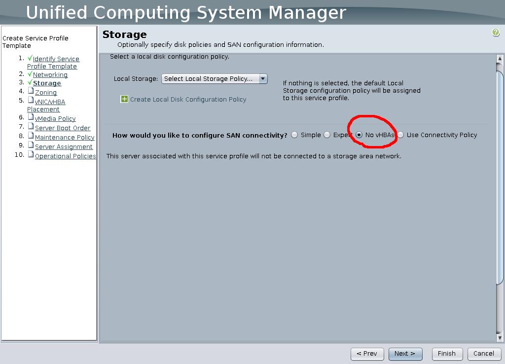
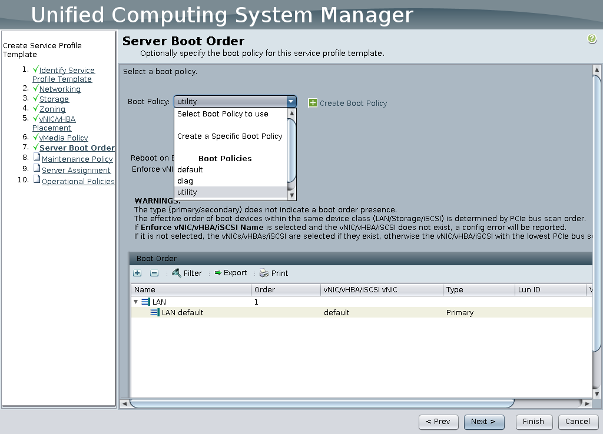
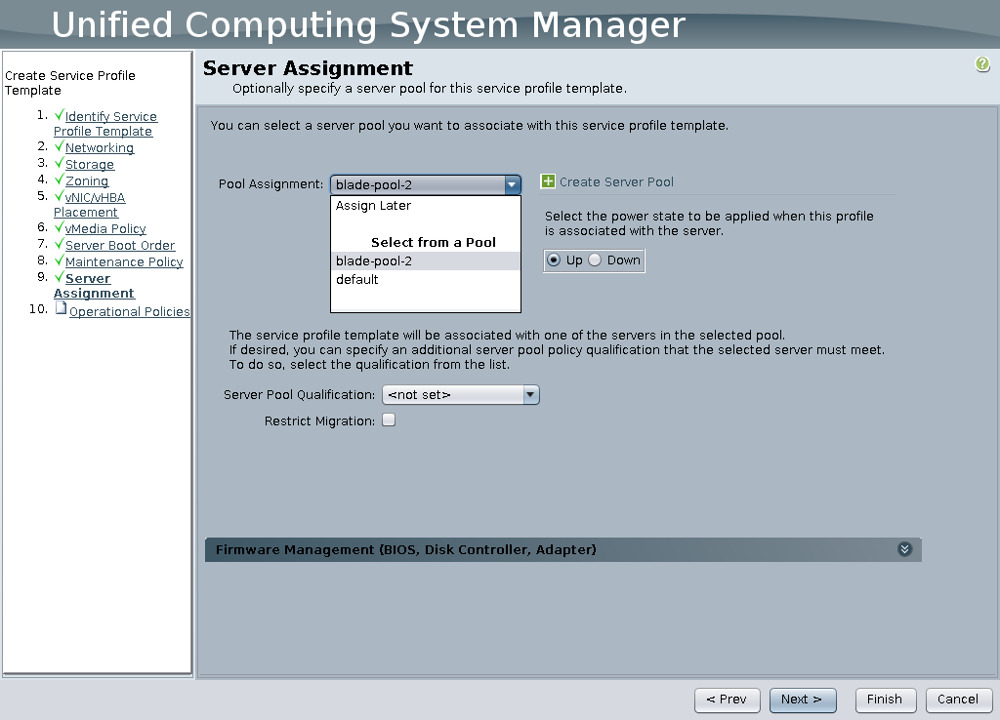

# Cisco UCS

This barclamp communicates with a Cisco UCS Manager instance 
via its XML-based API server, and can perform the following 
functions:

* Instantiate UCS service profiles for SUSE OpenStack Cloud compute and 
  storage nodes from predefined UCS service profile templates.
* Reboot and power up/down nodes.

## Prerequisites

* A Cisco UCS Manager server, or the UCS Platform Emulator
  (see below).
* In Cisco’s UCS Manager, it is necessary to create two 
  service profile templates called `suse-cloud-compute` 
  and `suse-cloud-storage`.  These names are case sensitive.

### `suse-cloud-compute` service profile template

This service profile template is to be used for preparing systems 
as SUSE OpenStack Cloud compute nodes. Minimum requirements:

* 20GB storage
* 8GB RAM
* 1 NIC
* Processor supporting AMD-V or Intel-VT

### `suse-cloud-storage` service profile template

This service profile template is to be used for preparing systems 
as SUSE OpenStack Cloud storage nodes.

### UCS administrator account

A user account must be created with administrative rights in the 
Cisco UCS Manager, and the barclamp will use the credentials of 
that account.

The account must have access to the above service profile templates,
and have authorization to create service profiles and associate 
them with physical hardware.

## Configuration

* Log in to the Crowbar admin interface: http://yourhost
* There should now be a tab labelled "UCS".
* Click the UCS tab. The settings screen will be opened where the
  following information needs to be entered.
    * URL - this should have the form of: `http://<ucsmanagerhost>/nuova`
    * Username & Password - credentials from the administrator account
      described above.

## Usage

* Click the UCS tab in the Crowbar admin interface.
* Identify the servers to be used for compute or storage, select the servers,
  select the action and click the update button.  This action may take many
  minutes to fully complete.  
* To refresh the screen, click the UCS tab (or Dashboard sub-menu item).

## Troubleshooting

All troubleshooting should be done within the Cisco UCS Manager interface.

## Testing with the UCS Platform Emulator

The UCS Platform Emulator can be [downloaded from Cisco's
website](https://communities.cisco.com/ucspe)
after registering for a free account.

### Prerequisites

The Emulator was designed to run as a VMware virtual machine.
However, it has been shown to work fine as an `x86_64` VM running
under KVM on openSUSE 13.1 or Leap 42.1, by converting to `.qcow2` file,
a separate disk device, and 3 `pcnet` virtual interfaces configured
on the same network as the Crowbar admin node.

### Starting the emulator VM

Here are the steps to start the UCS Platform Emulator using KVM with virtual 
cloud on cloud-admin network:

* Extract the downloaded .ova file.
  `tar xvf UCSPE_$Version.ova`
  This results in 3 files: `UCSPE_$Version-disk1.vmdk`, `UCSPE_$Version.ovf`
  `UCSPE_$Version.mf` .
* Convert the VMDK image to qcow2 (Because image created by VMDK version 3
  is ReadOnly).
  `qemu-convert -O qcow2 UCSPE_Version-disk1.vmdk UCSPE_$Version-disk1.qcow2`
* Start the VM using [ucspe_vm1.xml](ucspe/ucs_vm1.xml) file after updating the image path
  * Replace `$PATH_TO_UCSPE_QCOW2_IMAGE` with UCSPE image path
* Upon startup the VM may not get an IP address from the admin node's DHCP
  server. In this case you may need to connect to the emulator through the VNC
  console (log in as user `ucspepe` with password `ucspepe` and configure
  networking manually.

### Creating A Hardware Inventory

The UCS emulator VM may start out with a blank hardware inventory, which will
in turn leave the barclamp with no servers to work with. Since adding hardware
to the emulator is a bit finicky (the Start-Up Inventory dialog will under
certain circumstances omit vital components such as PSUs or fans when dragging
servers into the Rack Servers or Chassis areas) we provided [a known good
startup inventory](ucspe/startup-inventory.xml).

To use it, log in to the emulator's web interface, select _Emulator Settings_ /
_Start-up Inventory_ on the left side, and click the _Import XML File_ icon.
After a successful import the _Start-up Inventory_ dialog should look similar
to this:

Once the hardware inventory has been imported you need to restart the UCSPE
processes by selecting _Restart_ / _Restart UCSPE_ on the left side and setting
the Radio button to _Yes_ to confirm. Restarting should take 2-3 minutes. After
this time period you should be able to reload the emulator web interface.

This barclamp has been tested with version 3.0(2cPE1) of the emulator.

### UCS configuration

_Note: This describes a minimal workable setup for API testing on the UCS
emulator and is not suitable for production use._

The UCS emulator does not come with the service profile template configurations
described above. The steps below should leave you with a service template that
allows you to allocate UCS machines through crowbar. You will have to go
through these steps twice to create both service profile templates

_Note: the emulator does not go as far as emulating actual servers, it only
provides a realistic simulation of the UCS UI's behaviour. It is sufficient for
testing Crowbar's UCS API provisioning code, though._

#### Creating a minimal service profile template

Service profile templates such as the `suse-cloud-compute` and
`suse-cloud-storage` templates described above govern the machine pools
machines for a given service template are drawn from and the properties
machines need to have (i.e. in cases where they are drawn from heterogenous
machine pools with multiple available configurations). This section will walk
you through the service creation wizard. Since you will not deploy actual
machines, most settings in the wizard are not important for the emulator's
purpose. There are a few identifiers such as MAC addresses and UUIDs that are
drawn from finite pools that start out empty and must be defined manually.

_Note: On dialog steps that are not mentioned below you can simply hit the
`Next` button since they do not require any non-default settings._

##### Starting the service profile template creation wizard

First of all, start the profile template creation wizard by navigating to the
_Service Profile Templates_ Dialog and clicking the button circled in red, as
shown in the sccreenshot:

##### Identify Service Profile Template

The wizard's first step holds the first pitfall: by default there is an empty
UUID pool selected. Change this selection to _Hardware Default_, as shown in
this screenshot:

##### Networking

In the networking dialog you will need to select _Expert_ mode (red circle in
the screenshot below) and add a vNIC (blue circle):

In the ensuing _Create vNIC_ dialog you will need to specify an interface name
(red circle in the screenshot below) and select the Pool _mac-pool-1_ for the
_MAC Address Assignment_ field (blue circle):

##### Storage

In this dialog it is easiest to simply disable SAN storage to avoid having to
create a pool of World Wide Node Names. To achieve this, just select the _No
vHBAs_ option (red circle in the screenshot below):

)

##### Server Boot Order

Technically you needn't change any settings in this dialog, since the emulator
does not go as far as emulating the hardware it spins up. If this ever changes
you would probably have to select the _utility_ boot policy here (as shown in
the screenshot below) to ensure the servers governed by this template attempt
PXE boot.

##### Server Assignment

In this step you assign the "physical" hardware this service profile template
should apply to. Just select _blade-pool-2_ as shown in the screenshot below.
This will assign the "physical" blade servers you created when importing the
startup hardware inventory.

### Connecting the emulator to crowbar

If you followed the above steps you should now have a working UCS emulator. The
emulator already has a default administrative account (User: `ucspe`, Password
`ucspe`).  To connect the emulator to Crowbar, enter the appropriate URL and
login credentials as described in the [Configuration](#configuration) section.
You should then be able to allocate the "physical" machines in the emulator's
hardware inventory as Compute or Storage nodes.
